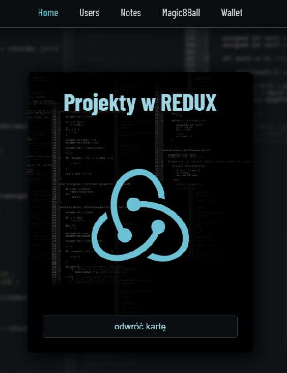
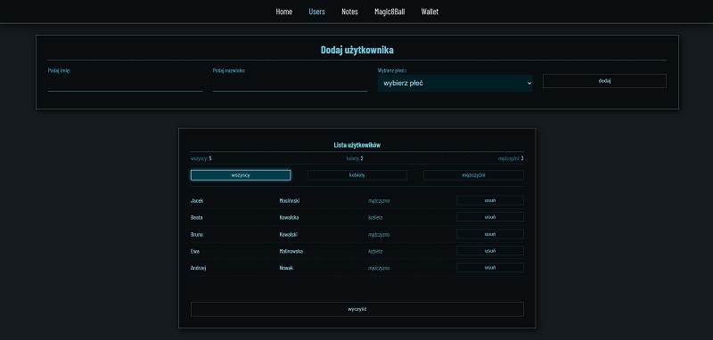
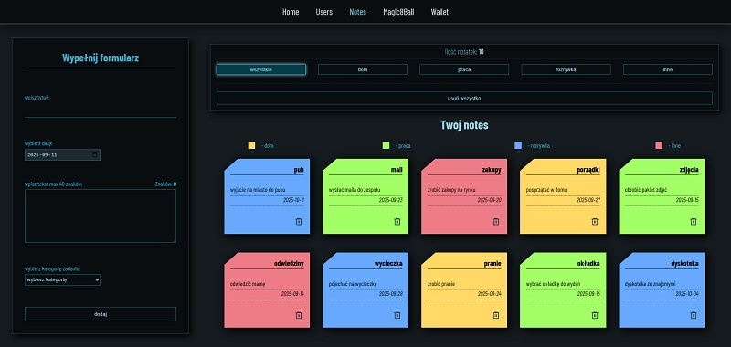

# React + TypeScript + Vite

# --------------------

### This project uses the react-dom library. Navigation takes you to two projects. Technologies used in the project are: React, TypeScript and Readux. The module.css method was used for styling.

---

## How to run

All commands are run from the root of the project, from a terminal:

| Command       | Action                         |
| :------------ | :----------------------------- |
| `npm install` | Installs dependencies          |
| `npm run dev` | Copy localhost link to browser |

---

## live:

https://simpleprojectreactredux.vercel.app/

### The technology used is:

- React
- TypeScript
- Redux
- module.css

# --------------------

### resolution:

- from mobile to 1200px

---



# --------------------

<h2>Project 1: Users list</h2>



<p>In this project you enter a list of users by providing name, surname and gender. The counter shows the total number of users, the number of women and the number of men. There is also a possibility of selecting users so that the list of all, women and men is displayed</p>

# --------------------

<h2>Project 2: Notes</h2>



<p>In this project there is a notebook. Notebook cards contain title, content and date added. There is also selection by category of note. Color of card highlights category, you can also display only given category or all notes</p>

# --------------------

<h2>Project 3: Magic8Ball</h2>


<p>In this project you can ask a question, click on the ball and get a random answer</p>

# --------------------

<h2>Project 4: Wallet</h2>


<p>In this project, you can manage your income and expenses. Data is saved in local storage and will be permanently accessible for management in a given browser</p>

---

This template provides a minimal setup to get React working in Vite with HMR and some ESLint rules.

Currently, two official plugins are available:

- [@vitejs/plugin-react](https://github.com/vitejs/vite-plugin-react/blob/main/packages/plugin-react) uses [Babel](https://babeljs.io/) for Fast Refresh
- [@vitejs/plugin-react-swc](https://github.com/vitejs/vite-plugin-react/blob/main/packages/plugin-react-swc) uses [SWC](https://swc.rs/) for Fast Refresh

## Expanding the ESLint configuration

If you are developing a production application, we recommend updating the configuration to enable type-aware lint rules:

```js
export default tseslint.config({
	extends: [
		// Remove ...tseslint.configs.recommended and replace with this
		...tseslint.configs.recommendedTypeChecked,
		// Alternatively, use this for stricter rules
		...tseslint.configs.strictTypeChecked,
		// Optionally, add this for stylistic rules
		...tseslint.configs.stylisticTypeChecked,
	],
	languageOptions: {
		// other options...
		parserOptions: {
			project: ['./tsconfig.node.json', './tsconfig.app.json'],
			tsconfigRootDir: import.meta.dirname,
		},
	},
})
```

You can also install [eslint-plugin-react-x](https://github.com/Rel1cx/eslint-react/tree/main/packages/plugins/eslint-plugin-react-x) and [eslint-plugin-react-dom](https://github.com/Rel1cx/eslint-react/tree/main/packages/plugins/eslint-plugin-react-dom) for React-specific lint rules:

```js
// eslint.config.js
import reactX from 'eslint-plugin-react-x'
import reactDom from 'eslint-plugin-react-dom'

export default tseslint.config({
	plugins: {
		// Add the react-x and react-dom plugins
		'react-x': reactX,
		'react-dom': reactDom,
	},
	rules: {
		// other rules...
		// Enable its recommended typescript rules
		...reactX.configs['recommended-typescript'].rules,
		...reactDom.configs.recommended.rules,
	},
})
```
